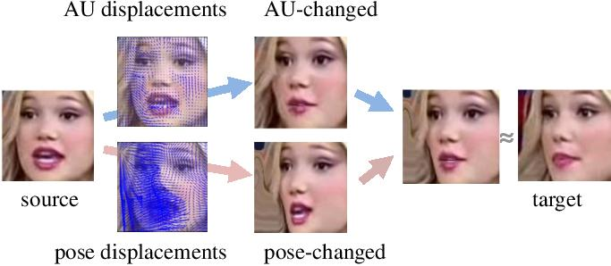

### Self-supervised Representation Learning from Videos for Facial Action Unit Detection, CVPR 2019 (oral)

We propose a Twin-Cycle Autoencoder (TCAE) that self-supervisedly learns two embeddings to encode the movements of **Facial Actions** and **Head Motions**.


*Given a source and target facial images, TCAE is tasked to change the AUs or head poses of the source frame to those of the target frame by predicting the AU-related and pose-related movements, respectively.*

The generated AU-changed and pose-changed faces are shown as below:


*Please refer to the [original paper](http://openaccess.thecvf.com/content_CVPR_2019/papers/Li_Self-Supervised_Representation_Learning_From_Videos_for_Facial_Action_Unit_Detection_CVPR_2019_paper.pdf) and [supplementary file](http://openaccess.thecvf.com/content_CVPR_2019/supplemental/Li_Self-Supervised_Representation_Learning_CVPR_2019_supplemental.pdf) for more examples.*

### Training yourself:

- Download the training dataset: [Voxceleb1/2](http://www.robots.ox.ac.uk/~vgg/data/voxceleb/)
- Extract the frames at 1fps, then detect & align the faces
- Split the face images for training/validation/testing by **dataset_split.py**
- Train TCAE by **self_supervised_train_TCAE.py**

*The learned AU embedding from TCAE can be used for both **AU detection** and **facial image retrieval**.*

### If you use this code in your paper, please cite the following:
```
@inproceedings{li2019self,
  title={Self-supervised Representation Learning from Videos for Facial Action Unit Detection},
  author={Li, Yong and Zeng, Jiabei and Shan, Shiguang and Chen, Xilin},
  booktitle={CVPR},
  year={2019}
}
```
